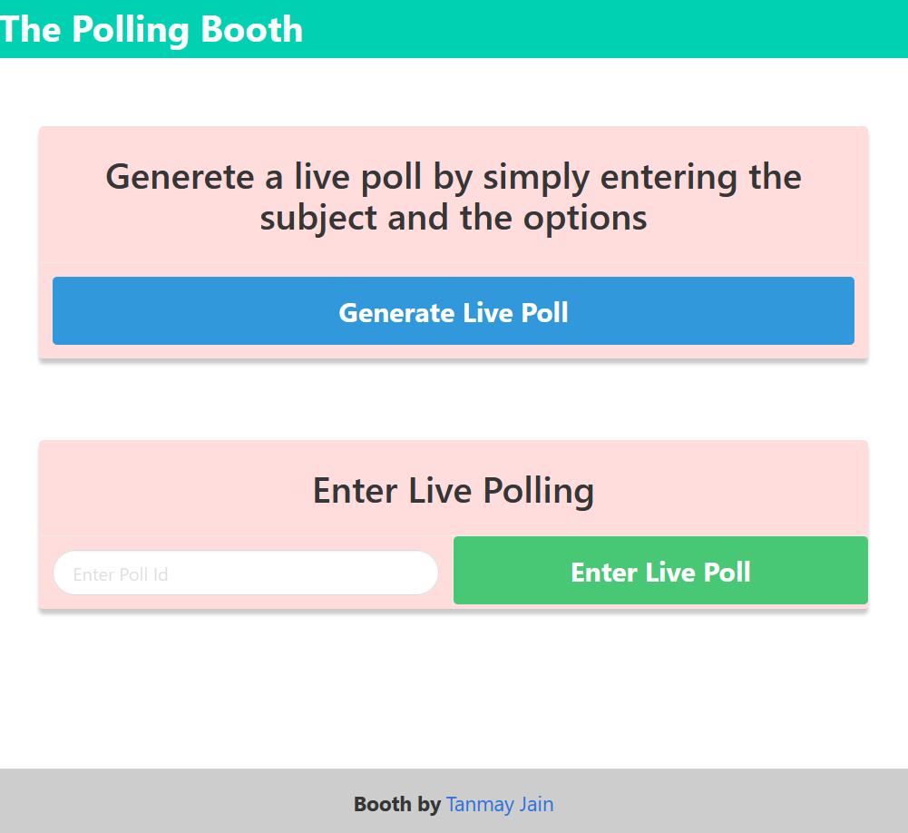
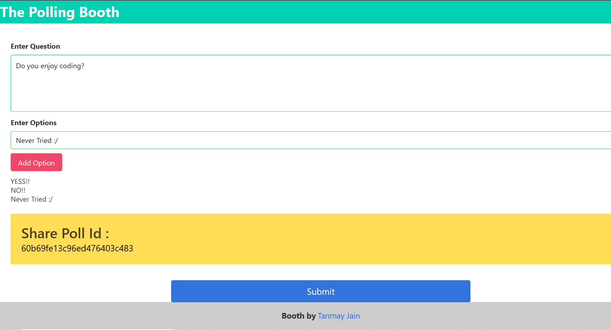
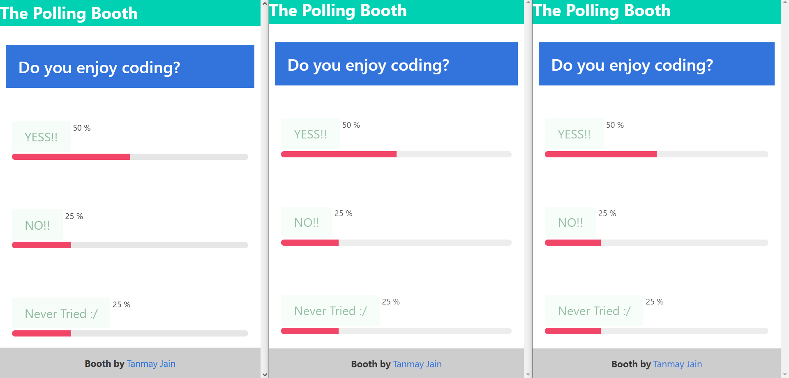

# The Polling Booth

**Create and share poll that gives you real-time results**

***
## Project Structure
***
**Backend (Server)**
```
src
├───controller
├───db
├───public
│   ├───app
│   ├───components
│   ├───css
│   └───js
└───routes
    └───polls
```
**Frontend (Client Side Code)**
```
public
│   index.html
│
├───app
│       common.js
│       home.js
│       makePoll.js
│       pollPage.js
│       socketClient.js
│       style.css
│
├───components
│       footer.html
│       home.html
│       makePoll.html
│       navbar.html
│       pollPage.html
│
├───css
└───js
        jquery-3.6.0.js
```
## Business Logic
***
### Users

Two types of users
- **The host of the Poll**
This user will generate the poll.
The required feilds are 1)**The Poll Question** 2) **The Options**
After that the Poll Id is generated which the user has to share.

- **The user who will cast the vote**
This User will have to enter the Poll Id and enter the live poll.

## API Documentation
***

### ```polls ```
```GET  api/polls/:id```
Gets the Poll wtih the given Id

```POST api/polls/```
Create a new live poll. Required fields in body -
- pollQuestion
- pollOption 
pollOption takes an array of objects which contains 2 fields->
1. id:  (integer)
2. name: (string)
***



